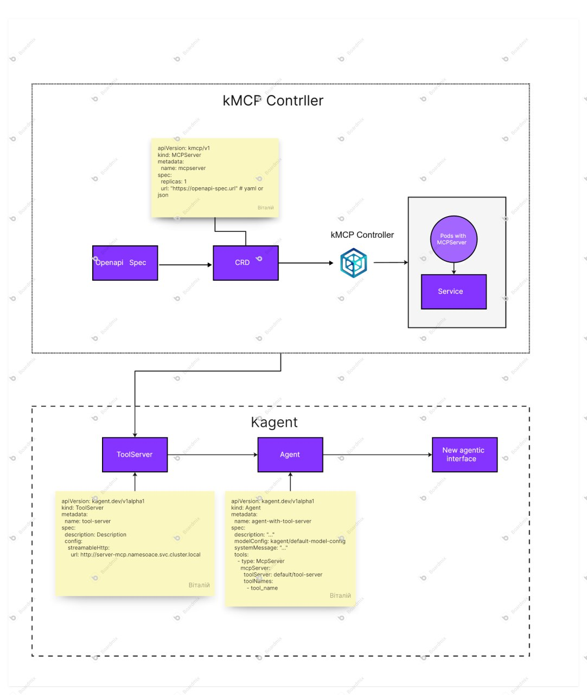

# Kubernetes MCP generator operator
The MCP Generator Operator simplifies the development of agentic applications by automating the creation of a protocol layer between AI agents and existing systems that expose HTTP APIs. By parsing OpenAPI specifications and generating a Model Context Protocol (MCP), it enables seamless, structured interaction between autonomous agents and external services, accelerating integration and reducing manual overhead.

## Description

The MCP (Model Context Protocol) Generator Operator is designed to streamline the integration of AI agents with existing web services in Kubernetes environments. It automates the generation of protocol layers that act as an interface between autonomous agents and services defined by HTTP APIs, such as RESTful backends and microservices.

At its core, the operator watches for custom Kubernetes resources that specify an OpenAPI specification, Upon detecting a new specification, it automatically triggers code generation workflows—using tools like OpenAPI Generator—to produce a context-aware agent interface layer. This layer standardizes how agents interact with APIs, ensuring consistent, structured communication.

This approach is especially useful in agentic systems where an LLM-driven agent must query, invoke, or reason about external APIs. Instead of manually writing boilerplate wrappers or SDKs, developers can declaratively define API sources and let the operator handle the rest.

### Use Cases

* Accelerating development of AI-native applications by reducing API integration overhead.

 * Enabling autonomous systems to reliably and safely interact with microservices or legacy systems via OpenAPI-based interfaces.

 * Maintaining consistent communication patterns across multiple services or environments without manual intervention.

 * By embedding the generation and deployment of these interface layers directly into the Kubernetes workflow, the MCP Generator Operator bridges the gap between large language models and existing infrastructure.

## Demo
[Video](media/demo.mp4)

[Code](docs/demo.yml)
## Install

### Using Helm

Install the MCP operator using Helm:

```bash
helm install mcp-operator oci://ghcr.io/v2dy/mcp-operator --version 0.2.0
```

## Quick Start

After installation, create an MCP server by applying this example:

```bash
cat <<EOF | kubectl apply -f -
apiVersion: mcp.my.domain/v1
kind: MCPServer
metadata:
  namespace: default
  labels:
    app.kubernetes.io/name: operator
    app.kubernetes.io/managed-by: kustomize
  name: mcpserver-sample4
spec:
  replicas: 1
  url: "https://raw.githubusercontent.com/open-meteo/open-meteo/refs/heads/main/openapi.yml"
  basePath: "https://api.open-meteo.com"
EOF
```

For more examples, see the [sample CRD configuration](config/samples/mcp_v1_mcpserver.yaml) and additional examples in the [examples/](examples/) folder.

## Local Registry for Testing

For faster development and testing, you can set up a local Docker registry within your Kubernetes cluster. This eliminates the need to pull images from external registries and speeds up the build process for MCP servers.

### Setting up Local Registry

Create a local registry in your cluster:

```bash
# Create registry namespace
kubectl create namespace registry

# Deploy the registry
cat <<EOF | kubectl apply -f -
apiVersion: apps/v1
kind: Deployment
metadata:
  name: docker-registry
  namespace: registry
spec:
  replicas: 1
  selector:
    matchLabels:
      app: docker-registry
  template:
    metadata:
      labels:
        app: docker-registry
    spec:
      containers:
      - name: registry
        image: registry:2
        ports:
        - containerPort: 5000
        env:
        - name: REGISTRY_STORAGE_FILESYSTEM_ROOTDIRECTORY
          value: /var/lib/registry
        volumeMounts:
        - name: registry-storage
          mountPath: /var/lib/registry
      volumes:
      - name: registry-storage
        emptyDir: {}
---
apiVersion: v1
kind: Service
metadata:
  name: docker-registry
  namespace: registry
spec:
  selector:
    app: docker-registry
  ports:
  - port: 5000
    targetPort: 5000
EOF
```

### Configure MCP Operator for Local Registry

Update your MCP Operator deployment to use the local registry:

```bash
# Configure the operator to use local registry for built images
kubectl set env deployment/mcp-operator-controller-manager \
  REGISTRY_URL=docker-registry.registry.svc.cluster.local:5000 \
  -n mcp-operator-system
```

### Benefits of Local Registry

- **Faster builds**: No external network dependency for image storage
- **Isolated testing**: Images remain within your cluster
- **Reduced bandwidth**: No external image pulls during development
- **Quick iteration**: Faster feedback loop for testing changes

### Cleanup

To remove the local registry:

```bash
kubectl delete namespace registry
```

> **Note**: The local registry uses ephemeral storage. Images will be lost when the pod is restarted. For persistent storage in production-like testing, consider using a PersistentVolume.

## Demo

Watch the demo video: [Video](media/demo.mp4)

See the demo configuration: [Code](docs/demo.yml)

## Documentation

- [Architecture Decision Record](docs/adr/ADR-001.md)
- [High Level Design](HLD.md)



## Development


## Getting Started

### Prerequisites
- go version v1.24.0+
- docker version 17.03+.
- kubectl version v1.11.3+.
- Access to a Kubernetes v1.11.3+ cluster.

### To Deploy on the cluster
**Build and push your image to the location specified by `IMG`:**

```sh
make docker-build docker-push IMG=<some-registry>/operator:tag
```

**NOTE:** This image ought to be published in the personal registry you specified.
And it is required to have access to pull the image from the working environment.
Make sure you have the proper permission to the registry if the above commands don’t work.

**Install the CRDs into the cluster:**

```sh
make install
```

**Deploy the Manager to the cluster with the image specified by `IMG`:**

```sh
make deploy IMG=<some-registry>/operator:tag
```

> **NOTE**: If you encounter RBAC errors, you may need to grant yourself cluster-admin privileges or be logged in as admin.

**Create instances of your solution:**

You can apply the samples (examples) from the config/sample:

```sh
kubectl apply -k config/samples/
```

> **NOTE**: Ensure that the samples have default values to test it out.

### To Uninstall
**Delete the instances (CRs) from the cluster:**

```sh
kubectl delete -k config/samples/
```

**Delete the APIs(CRDs) from the cluster:**

```sh
make uninstall
```

**UnDeploy the controller from the cluster:**

```sh
make undeploy
```

## Releases

The project uses GitHub Actions for automated releases. When you push a tag (e.g., `v1.0.0`), it automatically:

- Builds and pushes Docker images for multiple architectures (amd64, arm64)
- Creates Helm charts with proper versioning
- Generates Kubernetes installer manifests
- Publishes release artifacts to GitHub Releases

Release artifacts include:
- `helm-mcp-operator-{version}.tgz` - Helm chart package
- `checksums.txt` - SHA256 checksums for verification

## Project Distribution

Following the options to release and provide this solution to the users.

### By providing a bundle with all YAML files

1. Build the installer for the image built and published in the registry:

```sh
make build-installer IMG=<some-registry>/operator:tag
```

**NOTE:** The makefile target mentioned above generates an 'install.yaml'
file in the dist directory. This file contains all the resources built
with Kustomize, which are necessary to install this project without its
dependencies.

2. Using the installer

For development purposes, you can use the locally generated installer after building it with the make target above.

### By providing a Helm Chart

The project automatically generates and publishes Helm charts as OCI artifacts. Users can install using:

```sh
helm install mcp-operator oci://ghcr.io/v2dy/mcp-operator --version <version>
```

The Helm chart is generated from the Kubernetes manifests and includes:
- Configurable resource limits and requests
- Security contexts and RBAC configurations  
- Service account and metrics service setup
- Customizable container registry settings

**NOTE:** The Helm chart is automatically updated during the release process. When you create a new release, the chart version and app version are automatically synchronized with the release tag.

## Contributing

We welcome contributions! To contribute to this project:

1. Fork the repository
2. Create a feature branch (`git checkout -b feature/amazing-feature`)
3. Make your changes and add tests
4. Commit your changes (`git commit -m 'Add some amazing feature'`)
5. Push to the branch (`git push origin feature/amazing-feature`)
6. Open a Pull Request

Please ensure your code follows the project's coding standards and includes appropriate tests.

**NOTE:** Run `make help` for more information on all potential `make` targets

More information can be found via the [Kubebuilder Documentation](https://book.kubebuilder.io/introduction.html)

## License

Copyright 2025.

Licensed under the Apache License, Version 2.0 (the "License");
you may not use this file except in compliance with the License.
You may obtain a copy of the License at

    http://www.apache.org/licenses/LICENSE-2.0

Unless required by applicable law or agreed to in writing, software
distributed under the License is distributed on an "AS IS" BASIS,
WITHOUT WARRANTIES OR CONDITIONS OF ANY KIND, either express or implied.
See the License for the specific language governing permissions and
limitations under the License.
