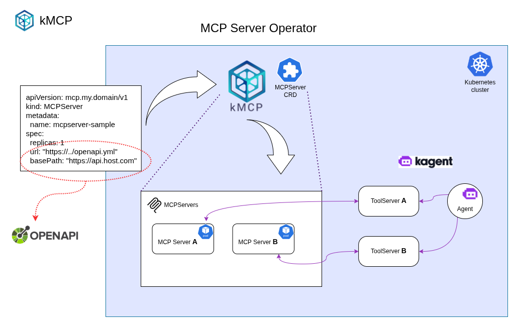

# High-Level Solution Design (HLD)

## Overview

kMCP is a Kubernetes Operator that automates the creation and management of MCP servers within a Kubernetes cluster. The Operator monitors custom resources containing links to OpenAPI specifications, automatically provisions MCP server instances based on these specs, and manages their lifecycle in a declerative way.

